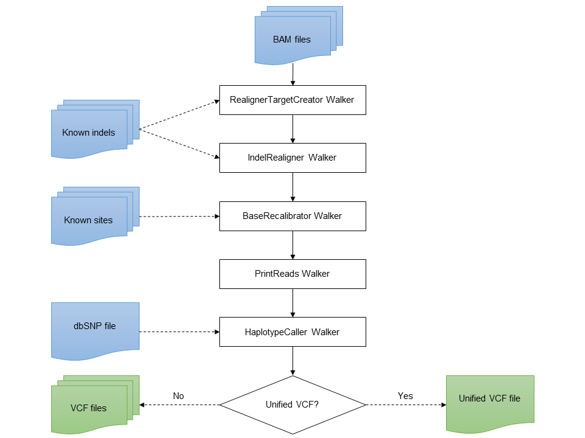

## hpexome: an automated workflow for processing whole-exome sequencing data

Whole-exome sequencing (WES) consists in the capture and sequence of all exons of protein coding genes in the human genome. It has been used in clinical applications like disease diagnosis. [Genome Analysis Toolkit (GATK)](https://software.broadinstitute.org/gatk/) is a programming framework for development of NGS data analysis tools. GATK provides tools for depth of coverage calculation analysis and single nucleotide polymorphism calling. These tools were used by large-scale sequencing projects such as 1000 Genomes Project and The Cancer Genome Atlas.

[GATK-Queue](http://gatkforums.broadinstitute.org/gatk/discussion/1306/overview-of-queue) is a command-line scripting framework for defining multi-stage genomic analysis pipelines combined with an execution manager that runs those pipelines from end-to-end. It has been used to implement workflows for WES data analysis. Our workflow for processing WES data was based on good practices described by authors of GATK software (Van der Auwera et al. 2002). It takes one or more BAM files, reference genome file, known SNP and indels databases, and outputs one or more VCF files.

Our workflow for processing WES data was based on good practices described by authors of GATK software. It takes one or more BAM files, reference genome file, known SNP and indels databases, and outputs one or more VCF files.



We used GATK-Queue workflow management to implement the workflow. It consists in a QScript file written in Scala programming language. The input parameters from every walker are set to default values but user can change theses values through the R interface.

Download latest version of __GATK-Queue__ at <a href="https://software.broadinstitute.org/gatk/download/queue" target="_blank">https://software.broadinstitute.org/gatk/download/queue</a>.

Download latest version of __hpexome__ <a href="https://raw.githubusercontent.com/labbcb/hpexome/master/Hpexome.scala" target="_blank">here</a>.

## Usage

``` bash
java -jar Queue.jar -S Hpexome.scala [OPTIONS]
```

OPTIONS:

- `-R` Inputs a reference genetic sequence. This parameter is _mandatory_.
- `-I` Inputs on or more sequences stored in a .bam file. This parameter is _mandatory_.
- `-dbsnp` Inputs the dbSNIP file, in which the rslIDs that are used to populate the ID column of the output. This parameter is _mandatory_.
- `-run` This parameter is _mandatory_, otherwise the Queue will only executed in test mode.
- `-known` Inputs the VCF file with known indels to be used with the Realigner Target Creator and the Indel Realigner.
- `-knownsites` Inputs a database of known polymorphic sites to skip over in the recalibration algorithm to be used in the BaseRecalibrator.
- `-stand_call_conf` Sets the minimum phred-scaled confidence threshold at which variants should be called in the Haplotype Caller. If this not specified, the program will use the default value, which is __30__.
- `-stand_emit_conf` Sets the minimum phred-scaled confidence threshold at which variants should be emmited in the Haplotype Caller. If this not specified, the program will use the default value, which is __30__.
- `-minPruning` Sets the minimum support to not prune paths in the graph in the Haplotype Caller. If this is not specified, the program will use the default value, which is 2.
- `-nt` Controls the number of data consecutive threads sent to the processor that are used in the parallelization process. It is used in the Realigner Target Creator, and may not be used together with the scattercount option. If not set, the walker will run in serial.
- `-nct` Controls the number of CPU threads allocated to each data thread. It is used with the Base Recalibrator and the Print Reads, and may not be used together with the `scattercount` option. If not set, the walkers will run in serial.
- `-L`Directs the GATK engine in restricting processing to genomic intervals. It is extremely useful when running the `scattercount` option with the Haplotype Caller, since it can prevent inaccuracies in its outputs.
- `-unifiedVCF` If included, this parameter will result in the results of all inputs in the Haplotype Caller be joined into a single output.If not included, each input will generate its own output.
- `-outdir` Sets the directory in which the outputs will be saved. If not set, the outputs will be saved in the directory in which the process is running.
- `-scattercount` Controls the number of parts in which the genetic sequence will be divided when sent to be parallelized by the Job executor engine. It  is used in all walkers. It must be used with the `-jobRuner`  option, or else it will not use the GridEngine and the process will be run in serial.
- `-jobRunner` Job executor engine (eg. Lsf706, Grid, PbsEngine).

Example:

``` bash
java -Djava.io.tmpdir=tmp -jar Queue.jar -S Hpexome.scala \
    -R hs37d5.fa -I sample1.bam -I sample2.bam \
    -dbsnp ALL.wgs.dbsnp.build135.snps.sites.vcf.gz \
    -stand_call_conf 30 -minPruning 2 \
    -nct 4 -nt 4 -outdir result \
    -known ALL.wgs.indels_mills_devine_hg19_leftAligned_collapsed_double_hit.indels.sites.vcf.gz \
    -known ALL.wgs.low_coverage_vqsr.20101123.indels.sites.vcf.gz \
    -knownSites ALL.wgs.dbsnp.build135.snps.sites.vcf.gz \
    -unifiedVCF -run
```

Example using Torque:

``` bash
java -Djava.io.tmpdir=tmp -jar Queue.jar -S Hpexome.scala \
    -R hs37d5.fa -I sample1.bam -I sample2.bam \
    -dbsnp ALL.wgs.dbsnp.build135.snps.sites.vcf.gz \
    -stand_call_conf 30 -minPruning 2 \
    -nct 4 -nt 4 -outdir result \
    -known ALL.wgs.indels_mills_devine_hg19_leftAligned_collapsed_double_hit.indels.sites.vcf.gz \
    -known ALL.wgs.low_coverage_vqsr.20101123.indels.sites.vcf.gz \
    -knownSites ALL.wgs.dbsnp.build135.snps.sites.vcf.gz \
    -unifiedVCF -run \
    -scattercount 4 -jobRunner PbsEngine
```

## References

__From FastQ Data to High-Confidence Variant Calls: The Genome Analysis Toolkit Best Practices Pipeline__ Van der Auwera GA, Carneiro M, Hartl C, Poplin R, del Angel G, Levy-Moonshine A, Jordan T, Shakir K, Roazen D, Thibault J, Banks E, Garimella K, Altshuler D, Gabriel S, DePristo M, 2013 _CURRENT PROTOCOLS IN BIOINFORMATICS 43:11.10.1-11.10.33_. [Article](http://dx.doi.org/10.1002/0471250953.bi1110s43)
