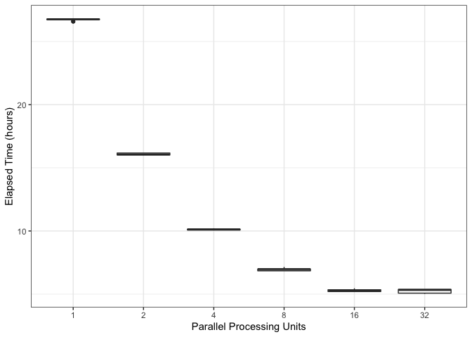
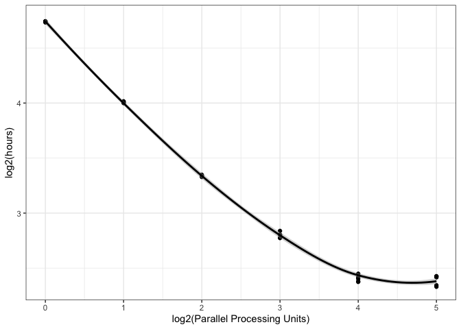

```r
library(tidyverse)
library(quantreg)
```

The observed times (in hours) to perform variant calling using HPexome on a high performance system managed via Sun Grid Engine (SGE) are shown below. The compute node used for this work has 48 CPUs and 78 GB of RAM.


```r
timings <- read_csv("hpexome_timings.csv") %>%
  mutate(elapsed = (end - start) / 3600) %>%
  select(scatter_count, count, elapsed)
```

```
## Parsed with column specification:
## cols(
##   scatter_count = col_double(),
##   count = col_double(),
##   start = col_double(),
##   end = col_double()
## )
```

```r
timings %>% 
  pivot_wider(names_from = scatter_count, values_from = elapsed) %>%
  select(-count)
```

<div class="kable-table">

        1          2          4          8         16         32
---------  ---------  ---------  ---------  ---------  ---------
 26.77028   16.06222   10.07861   7.153333   5.186667   5.337222
 26.72889   16.01194   10.14500   6.978333   5.345833   5.371667
 26.78694   15.99500   10.12056   6.845278   5.287500   5.378889
 26.57833   16.17028   10.04528   6.986944   5.203611   5.029444
 26.75333   16.17028   10.18667   6.837222   5.462222   5.079444

</div>

The boxplot below shows the gain in performance obtained through parallelization of the variant calling algorithm. One can easily note the dramatic decrease in time.


```r
ggplot(timings, aes(factor(scatter_count), elapsed)) + 
    geom_boxplot() + 
    labs(x='Parallel Processing Units', y='Elapsed Time (hours)') +
    theme_bw(base_size = 11)
```

<!-- -->

```r
ggsave("elapsed_time.png", dpi = 600)
```

```
## Saving 7 x 5 in image
```

We observed that the gain in time is not linear on the number of processing units. For this reason, we transform both variables (number of parallel processing units and time) to the logarithmic scale (base 2), as the Figure below shows. This strategy brings the relationship between both variables closer to linearity, allowing the use of advanced statistical methods for assessment of gains in performance.


```r
ggplot(timings, aes(log2(scatter_count), log2(elapsed))) + 
    geom_point() + 
    geom_smooth(method='loess', color='black') + 
    labs(x='log2(Parallel Processing Units)', y='log2(hours)') +
    theme_bw(base_size = 11)
```

<!-- -->

```r
ggsave("time_smooth.png", dpi = 600)
```

```
## Saving 7 x 5 in image
```

Below, we perform a quantile regression to estimate the median elapsed time (in the logarithmic scale) as a function of the number of parallel processing units (also in the logarithmic scale).


```r
fit = rq(log2(elapsed)~log2(scatter_count), tau=.5, data=timings)
summary(fit)
```

```
## 
## Call: rq(formula = log2(elapsed) ~ log2(scatter_count), tau = 0.5, 
##     data = timings)
## 
## tau: [1] 0.5
## 
## Coefficients:
##                     coefficients lower bd upper bd
## (Intercept)          4.53994      4.27083  4.73628
## log2(scatter_count) -0.53434     -0.58918 -0.43281
```

The table above shows the estimated median time in the logarithmic scale (4.54) for a run using a single processing unit. This model presents the evidences in favor of time reduction through parallel processing: the second coefficient (-0.53) quantifies the reduction in log2(time) for every time we double the number of parallel processing units. By representing the number of parallel processing units by $n$, we can rewrite this model as:
$$log_2(time) = 4.53 - 0.58 \times log_2(n).$$

Because the lower and upper confidence bounds for the $log_2(n)$ coefficient range bewtween $-0.73$ and $-0.63$ (i.e., the confidence interval does not include the zero, which would suggest the lack of association between the variables), we are 95\% certain that doubling the number of parallel processing units imply on a significant reduction of processing time. This model suggests that every time we double the number of processors, the required time for execution will be reduced to 65.23\% of what was needed before ($2^{-0.68427} = 0.6223 = 62.23\%$).


```r
new <- data.frame(scatter_count = unique(timings$scatter_count))
pred <- predict(fit, newdata = new)
data <- cbind(new, data.frame(log2time = pred, time = 2^pred))
write_csv(data, "log2_timings.csv")
data
```

<div class="kable-table">

 scatter_count   log2time        time
--------------  ---------  ----------
             1   4.539937   23.262553
             2   4.005600   16.062222
             4   3.471262   11.090570
             8   2.936924    7.657767
            16   2.402586    5.287500
            32   1.868248    3.650889

</div>

> Estimated Median Time to Completion of Process by Number of Parallel Processing Units.

Acknowledgements
================

We would like to thank the EMBRAPA Multiuser Bioinformatics Laboratory (http://www.lmb.cnptia.embrapa.br) for providing access to the high-performance computing environment.
